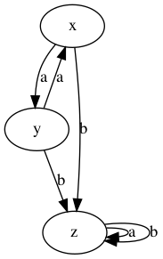
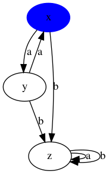
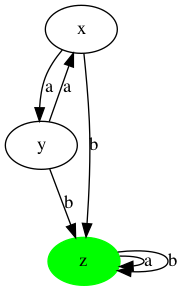
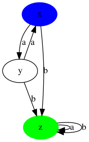

# PyFSA

[](https://github.com/taliamax/pyfsa/actions?query=workflow%3Abuild)
[](https://github.com/taliamax/pyfsa/actions?query=workflow%3Arelease)
[](https://pypi.org/project/pyfsa/)
[](https://pypi.org/project/pyfsa/)

[](https://github.com/taliamax/pyfsa)
[](https://github.com/taliamax/pyfsa/blob/master/LICENSE)
[](https://pypi.org/project/pyfsa/)

A python CLI to render finite state graphs.

This application takes a CSV file with state information, and uses it to either produce the finite state graph, and verify that strings are valid given the state information, a start state, and a desired state. The `string` subcommand is also able to render the traversal graph of a string through the state machine.

## Installation
You can install this project directly from github with `pip`, but it is also available in `pypi`. Install it like so:

```bash
python3 -m pip install pyfsa
```

GraphViz is required to run this, as graphviz is the rendering engine used to create the png files. You can find lots of information on how to do that here: https://graphviz.org/download/

On Ubuntu, you can find it in your package manager or install it directly using APT:

```bash
$ apt install graphviz
```

You might need to also install the graphviz development library to ensure the Python wrapper `pygraphviz` runs properly. You can find more information on installing `pygraphviz` on their [website](https://pygraphviz.github.io). On Ubuntu, you can install it with the following command:

```bash
$ apt install libgraphviz-dev
```


## Examples

State file:
```csv
trigger,source,target
a,x,y
b,x,z
a,y,x
b,y,z
a,z,z
b,z,z
```

```bash
fsa state -f examples/states.csv
```




```bash
fsa state -f examples/states.csv -s x
```



```bash
fsa state -f examples/states.csv -e z
```



```bash
fsa state -f examples/states.csv -s x -e z
```


